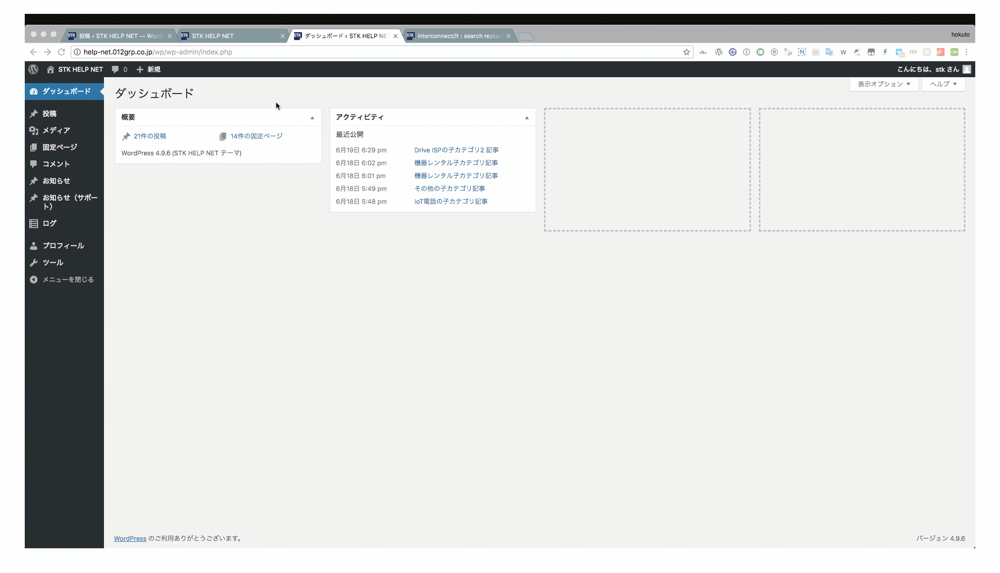
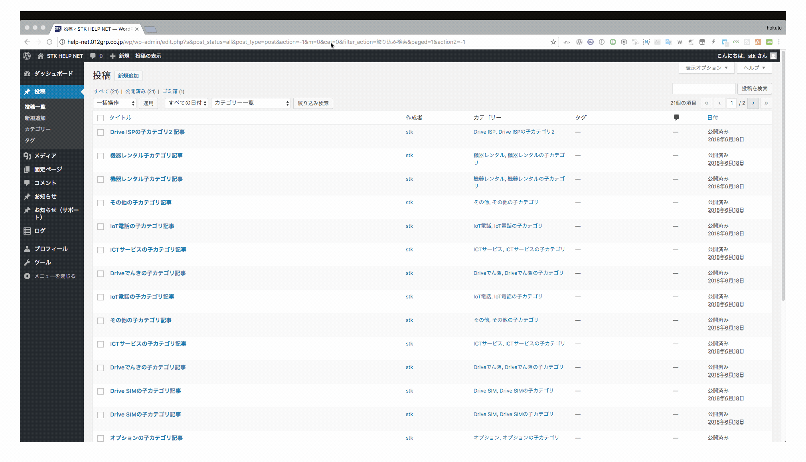
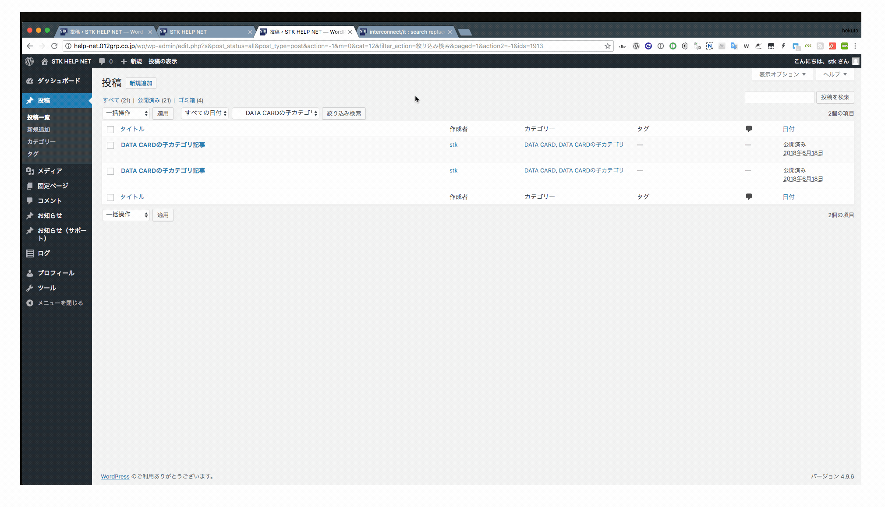
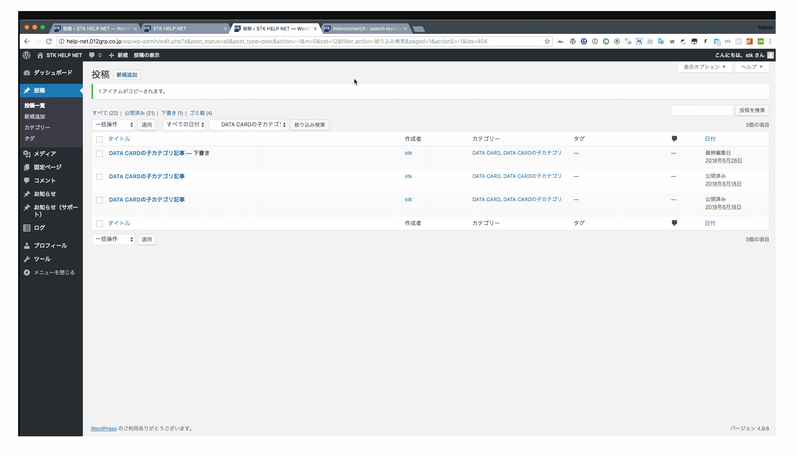

# 商材を新しく追加する

管理画面から、「投稿」にマウスを合わせるとさらにメニューが出てくるので、そこから「 投稿一覧 」をクリックします。

既に各カテゴリにテスト用の商材が追加されているので、こちらをコピー・もしくは編集して使うのが良いかと思います。  
今回はDrive ＞ Drive ISP ＞ DATA CARD の商材を追加してみることにします。  
一覧ページではカテゴリにより絞り込みが行なえるので、DATA CARDで絞り込みます。

既存の記事を複製します。

複製した記事を更新し、公開します。

公開すると、ページ反映されます。

