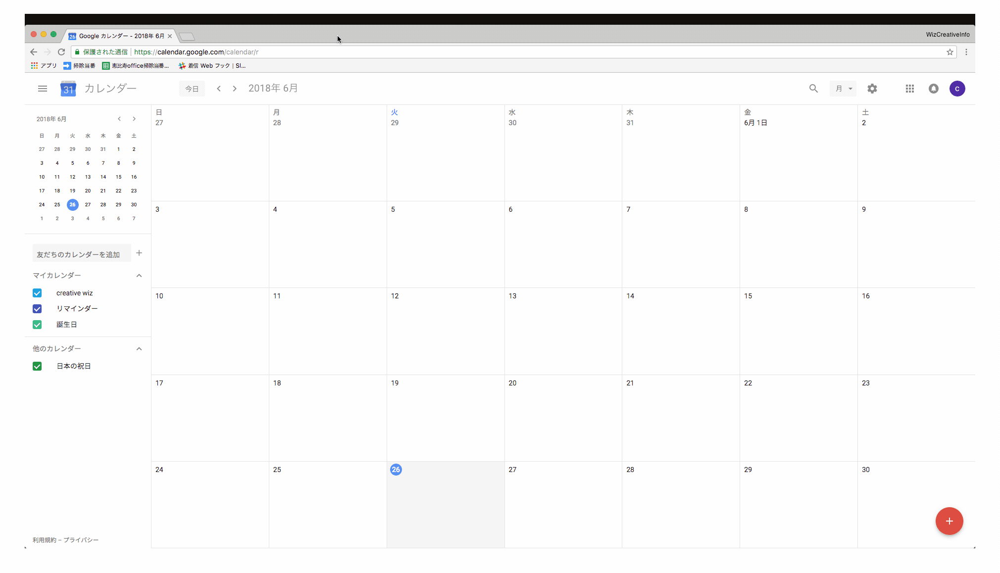
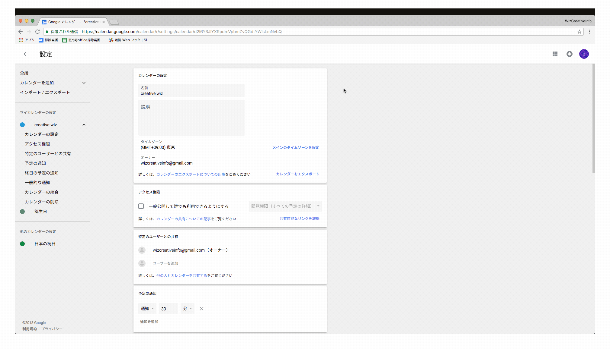
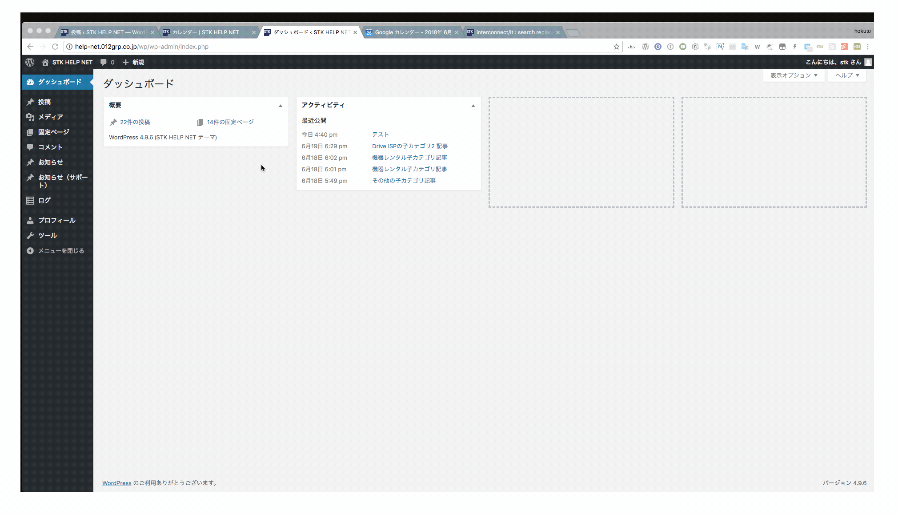
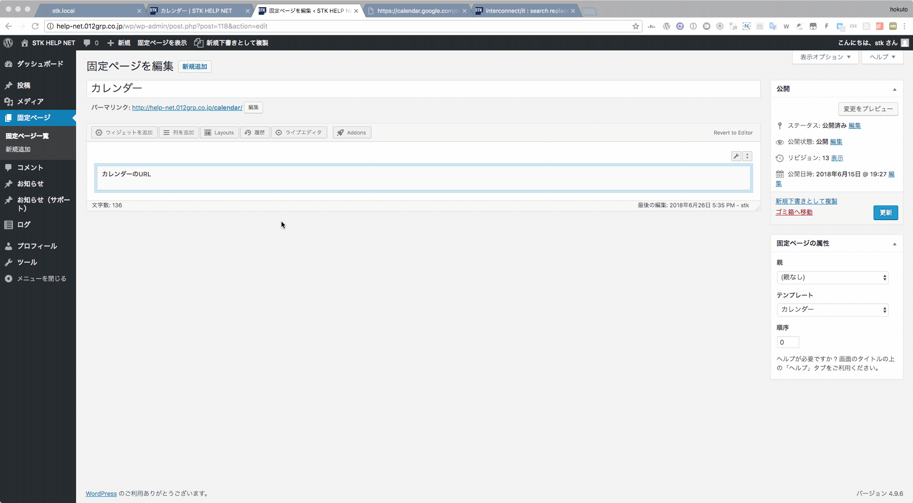

# カレンダーページの更新

## カレンダーのURLを取得する

公開するカレンダーがあるアカウントで  
[https://calendar.google.com/](https://calendar.google.com/)  
にアクセスし、カレンダーの設定画面に入ります。

設定画面の下の方に「埋め込みコード」があるので、これをコピーします。  
そのままコピーしても良いですが、カスタマイズリンクよりある程度カスタマイズもできるのでしておいたほうが見栄えはいいかと思います。

管理画面の　固定ページ＞固定ページ一覧＞カレンダー　をクリックします。

カレンダーページのURL編集画面に入り、先程コピーしたURLをペーストします。  
「終了」をクリックして、「公開」をクリックします。

ページに反映されます。

