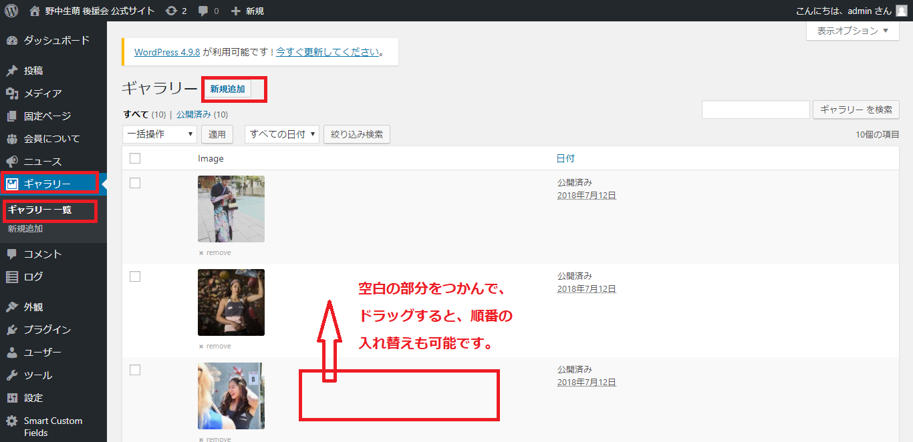
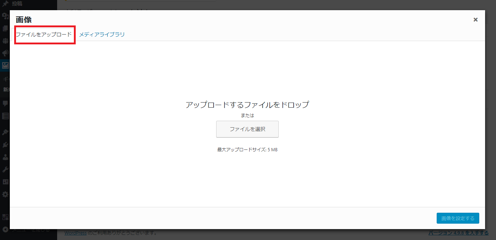
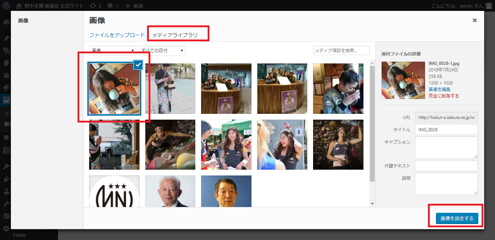
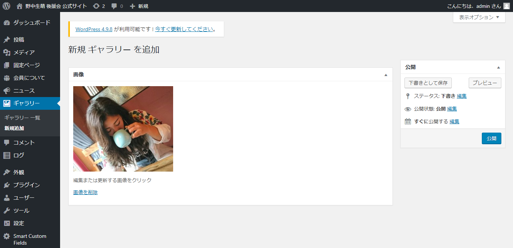

# ギャラリーの更新

## ギャラリーの新規登録

１．ワードプレスにログイン  
２．左にあるメニューから、ギャラリー/ギャラリー一覧/新規追加を選択します。

### 《順番の入れ替え》

この画面で順番の入れ替えも可能です。該当の画像の空白部分をつかんで、ドラッグ＆ドロップすると、順番が入れ替えられます。  
３．「新規追加」ボタンをクリック  
４．「画像を設定する」ボタンをクリック

５．下記のような画面に切り替わるので、「ファイルをアップロード」をクリック  
６．画面内に、追加したいファイルをドラッグ＆ドロップで移動します。（もしくは、「ファイルを選択」で、該当のファイルを選択）

７．画像がアップされると、「メディアライブラリ」に移動し、新たに登録した画像が選択されます。  
８．追加したい画像のみに、チェックマークが入っていることを確認し（もしくは追加したい画像を選択し）、右下の「画像を設定する」ボタンをクリック。

９．選択された画像が表示されます。右側の【公開】ボタンをクリックすると、本番ページに反映されます。

### 【公開をする前に、確認したい場合】

右側にある「プレビュー」で見た目を確認することもできます。

* 「プレビュー」⇒ 別ウィンドゥでプレビューが立ち上がります。OKであればウィンドゥを閉じて、元の編集タブに戻る。
* 「下書きとして保存」⇒本番ページには反映されず、管理画面のみ保存されます。

