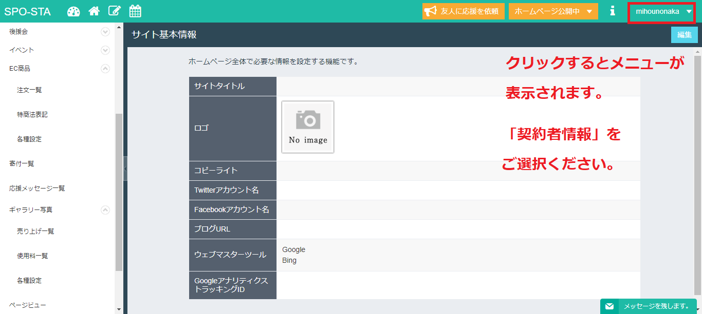
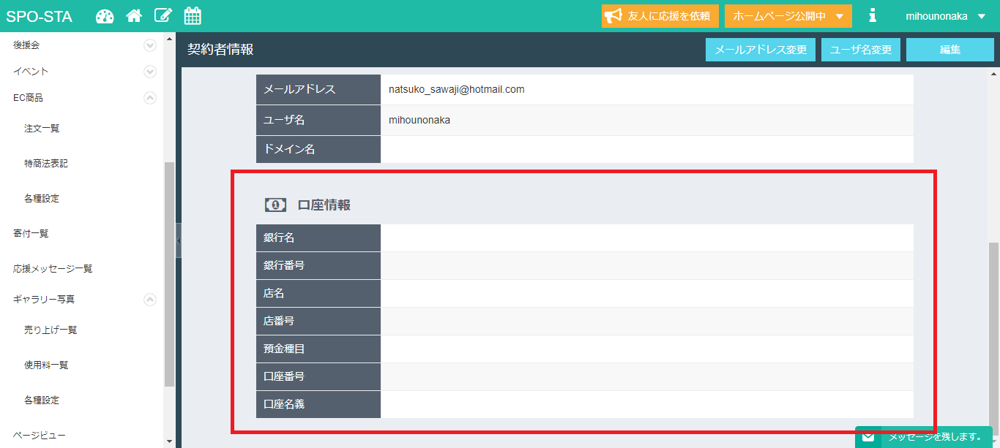

# 契約者情報の登録

１．右上のユーザー名をクリックください。

２．メニューが表示されるので「契約者情報」をご選択ください。

３．ページ遷移しますので、口座情報をご入力ください。

### 《ご確認ください》

↓口座情報にエラーがあると、手数料が余分にかかってしまうそうです。

たまにユーザー様の口座情報の入力に誤りがある場合、振込実行後にエラーが発生することがございます。その場合、組み戻し等の手数料はユーザー様のご負担となってしまいます。契約者様の情報は、個人情報保護の観点からこちらでの修正や変更など一切お受けすることが出来ません。

エラーが発生してからの対応となってしまいますので、入力の再にはお気を付け下さい。よくある誤入力が、―　や　.　、（　）　等の一見すると見分けが難しい文字の誤入力、他には銀行コードの入力忘れなどがございます。

注意して入力いただけますようお願い申し上げます。

