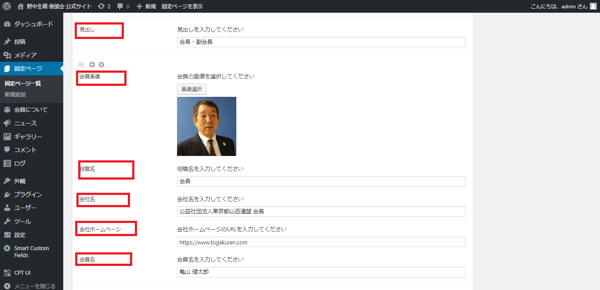

# 会員ページ/既存データを編集したい場合

1.  左メニュー/会員についてをクリック
2. ページ内の会員についてに移動。表示されていない場合は、◀ボタンをクリックして「会員について」エリアを表示

3. 恐らく、該当の項目を照らし合わせていただければ、編集いただけると思います。

※見出しは、（会長・副会長/（顧問）/若者サポーター/事務局）にあたります。  
※画像の追加方法に関しては、「ギャラリーの更新　５.～」ご参考ください。

4. 右側の【公開】ボタンをクリックすると、本番ページに反映されます。

### 【公開をする前に、確認したい場合】

右側にある「プレビュー」で見た目を確認することもできます。

* 「プレビュー」⇒ 別ウィンドゥでプレビューが立ち上がります。OKであればウィンドゥを閉じて、元の編集タブに戻る。
* 「下書きとして保存」⇒本番ページには反映されず、管理画面のみ保存されます。

