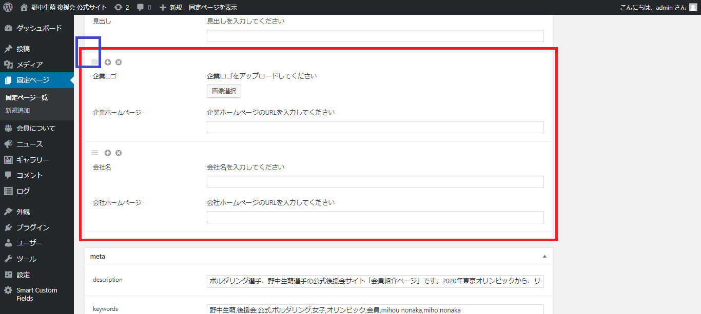

# 会員ページ/企業情報（ロゴあり）が追加になった場合

1.  左メニュー/会員についてをクリックください。
2. ページ内の会員についてに移動。表示されていない場合は、◀ボタンをクリックして「会員について」エリアを表示します。

 3. ページ内に、「企業ロゴ」と書かれたエリアがあります。

 4. 画像を選択し、情報をご入力ください。  
※画像の追加方法に関しては、「ギャラリーの更新　５.～」ご参考ください。

 5. 右側の【公開】ボタンをクリックすると、本番ページに反映されます。

企業（ロゴあり）の情報をご入力し【公開】ボタンを押すと、本番ページに企業（ロゴあり）エリアが表示されます。

※「企業（ロゴあり）」エリアに新規企業さまを追加したい場合は、青枠部分をクリックし、追加になったエリアに必要な情報を入力ください。

### 公開をする前に、確認したい場合

右側にある「プレビュー」で見た目を確認することもできます。

* 「プレビュー」⇒ 別ウィンドゥでプレビューが立ち上がります。OKであればウィンドウを閉じて、元の編集タブに戻ります。
* 「下書きとして保存」⇒本番ページには反映されず、管理画面のみ保存されます。

