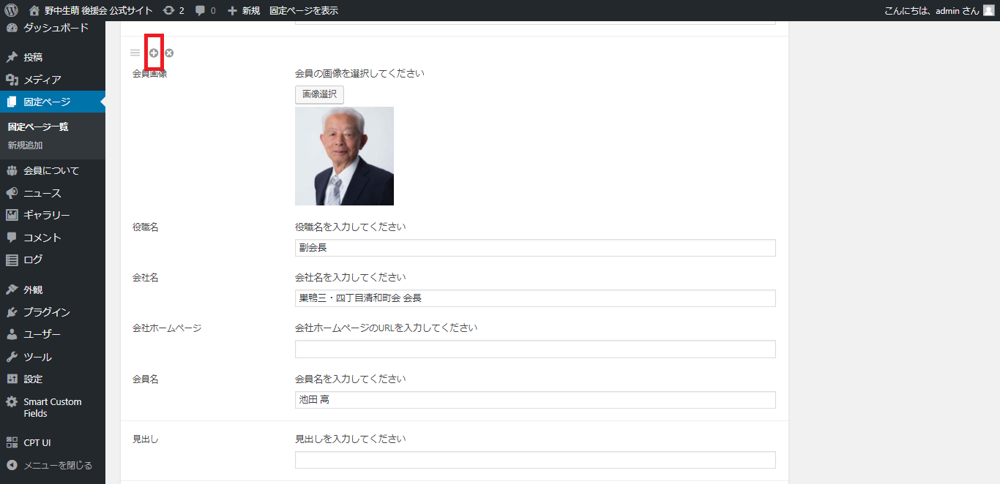

# 会員ページ/会員様を新規で追加したい場合

1.  左メニュー/会員についてをクリック
2. ページ内の会員についてに移動。表示されていない場合は、◀ボタンをクリックして「会員について」エリアを表示

3.  追加したい場所の、ひとつ前に表示されている会員さまの情報が記載されている箇所に移動。  
4．左上にある「＋マーク」をクリックします

5. ＋マークを追加した会員さま情報の下に、新規入力項目エリアが追加されます。

6. 必要な情報を入力します。  
※画像の追加方法に関しては、「ギャラリーの更新　５.～」ご参考ください。  
7. 右側の【公開】ボタンをクリックすると、本番ページに反映されます。

### 【公開をする前に、確認したい場合】

右側にある「プレビュー」で見た目を確認することもできます。

* 「プレビュー」⇒ 別ウィンドゥでプレビューが立ち上がります。OKであればウィンドゥを閉じて、元の編集タブに戻る。
* 「下書きとして保存」⇒本番ページには反映されず、管理画面のみ保存されます。

### 

  

  

