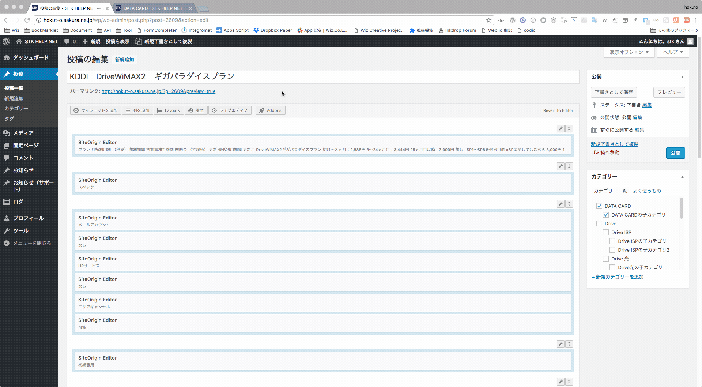

# 商材のカテゴリーについて

商材は

* 親カテゴリ
* 子カテゴリ
* 孫カテゴリ

と親・子・孫関係を持ってカテゴリ分けされています。

カテゴリーは、投稿＞カテゴリー　から確認できます。

親カテゴリ  
- 子カテゴリ  
-- 孫カテゴリ  
といった表記でカテゴリ分けされています。

商材ページを投稿するときに、このカテゴリを指定することによりページ上で分類された状態で表示することができます。

  
それでは、試しに

**親**：Drive  
**子**：DATA CARD  
**孫：**テストカテゴリ

として、テストカテゴリに商材を追加してみましょう。

まずは**孫：**テストカテゴリを追加します。

投稿一覧へ移動して、既存の記事を複製します。  
記事内容が既に入っているものが複製されるので、これを編集してみます。

タイトルを変更して、カテゴリを「テストカテゴリ」に変更して公開します。

公開されました！

