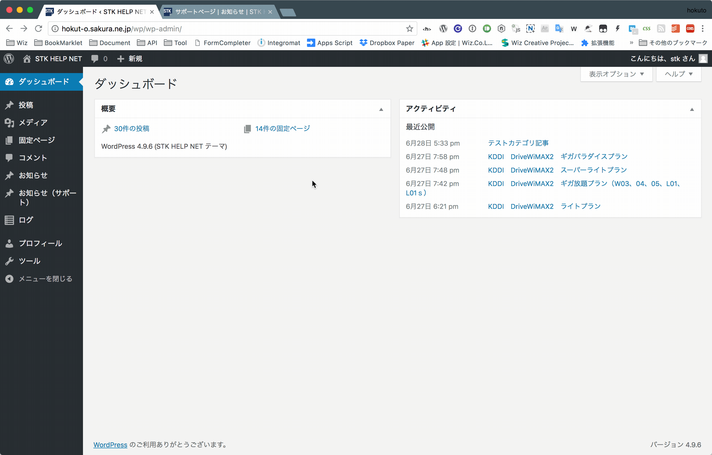

# お知らせページの更新

お知らせ（サポート）＞新規追加をクリックしてください。  
※ 商材ページのお知らせと間違えないようにご注意ください。

  
[商材ページのお知らせ更新](../pjino/orasepjino.md)と同様にタイトル・本文を入力、カテゴリーを選択して公開します。

  
公開されました。  
※ サポートページのお知らせ記事は、トップページ最上段の最新記事ゾーンには表示されません。

