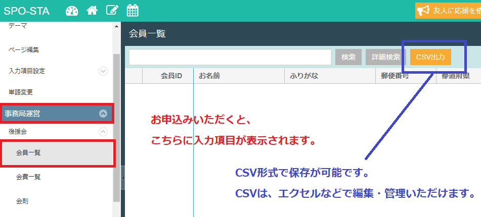

# スポスタ会員管理

１．お申込みいただくと、下記部分に会員情報が登録されます。  
２．情報は、CSV形式でダウンロードいただけます。

  
※基本的に会員一覧から情報が削除されることはないとのことです。  
　（以下、ユーザーの退会を除く）

| ユーザー様の退会処理について |
| :--- |
| 後援会機能を使用した入会者さまは、スポスタサイトに登録します。その際、マイページができるのですが、そのマイページから退会ができます。 ■退会の申し出があった場合ご自身で、スポスタサイトから退会することを事務局側でご案内します。《退会の手続きについて》マイページ→プロフィール情報/退会手続きができるボタンが表示されるので、そこからお手続きいただきます。※特殊な事情やトラブル等でユーザー様側からの退会が難しい場合は、　会員一覧のNG設定を使用します。■データ管理《ユーザー様がマイページからご自身の意思で退会された場合》　会員一覧からは消えますが、会費一覧にはデータが残ります。 《NG設定をした場合》　会員一覧からデータは消えず、NG状況欄に「NG設定中」と表示されます。　また、会費一覧では何も変化なく他の会員と同様に表示されます。 |

