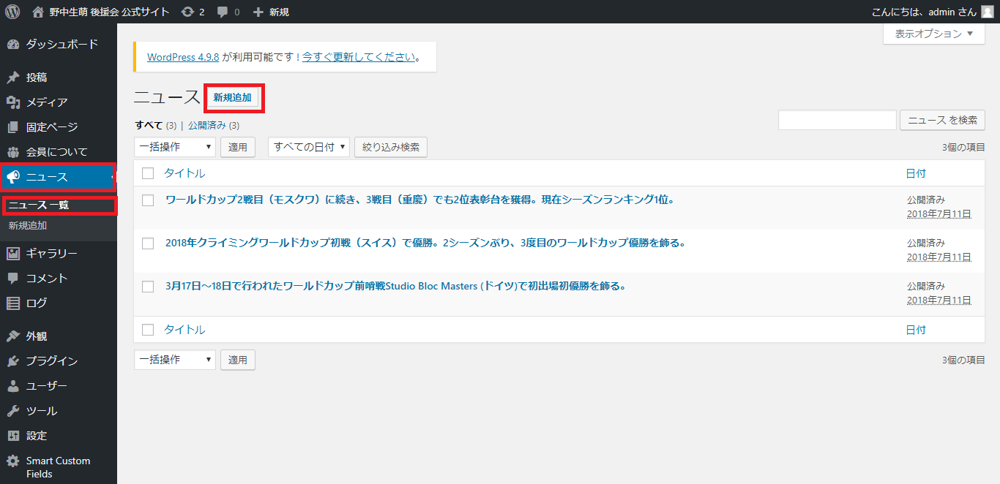
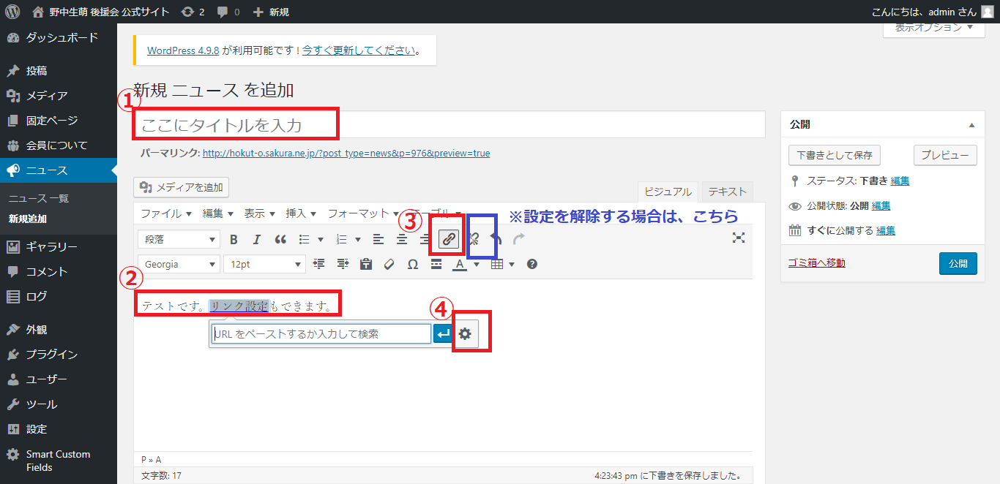
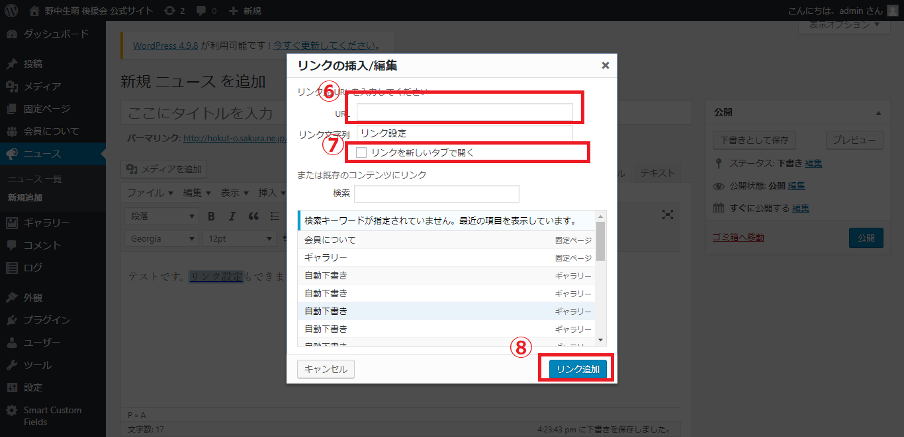

# ニュースの更新

## ニュースの新規登録

１．ワードプレスにログイン  
２．左にあるメニューから、ニュース/ニュース一覧/新規追加を選択します。  
３．以下の画面に遷移します。

４．①タイトルと、②本文を入力します。  
設定ボタンはいくつかありますが、基本的には、「リンク設定」のみ、ご使用いただくかと思います。

《本文に外部リンクを設定する場合》  
５．該当のテキストを選択した状態で、③のリンク設定ボタンを選択  
６．④キャプチャのような画面が表示されるので、右の歯車マークをクリック

《設定したリンクを削除する場合》  
該当のテキストを選択した状態で、↑青枠の「リンク削除」をクリックする。

７．歯車マークをクリックすると、ポップアップで、下記のようなウィンドゥが立ち上がる。

８．⑥飛び先のURLの入力と、⑦の部分にチェックを入れる。

基本的に外部サイトのリンク（http://mihounonaka-supporters.com以外ではじまるサイトへのリンク）に関しては、⑦をチェックしてください。ブラウザにより挙動は異なりますが、別ウィンドウで開き、サイトの離脱を防ぎます。

９．⑧リンクを追加　ボタンを押す。

10.　ポップアップウィンドゥが消え、前の画面に戻る。右側にある青い【公開】ボタンを押すと、本番サイトに反映

### 【公開をする前に、確認したい場合】

右側にある「プレビュー」で見た目を確認することもできます。

* 「プレビュー」⇒ 別ウィンドゥでプレビューが立ち上がります。OKであればウィンドウを閉じて、元の編集タブに戻る。
* 「下書きとして保存」⇒本番ページには反映されず、管理画面のみ保存されます。

