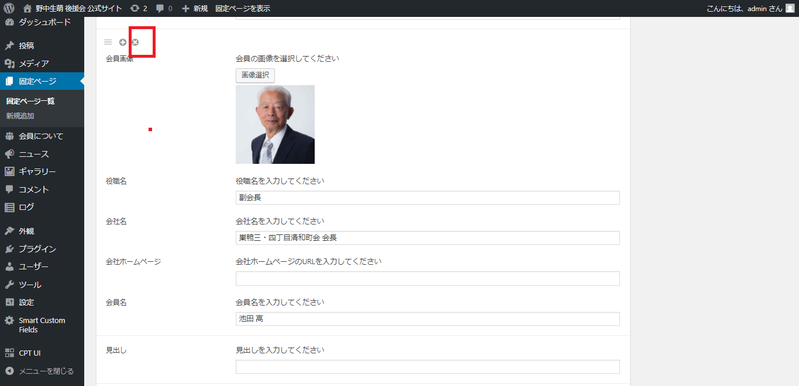

# 会員ページ/削除したい場合

1.  左メニュー/会員についてをクリックください。
2. ページ内の会員についてに移動。表示されていない場合は、◀ボタンをクリックして「会員について」エリアを表示します。

3.  該当の会員さま情報の、左上に表示される「×」マークをクリックください。

4.  該当の情報が削除されます。

5. 右側の【公開】ボタンをクリックすると、本番ページに反映されます。

### 公開をする前に、確認したい場合

右側にある「プレビュー」で見た目を確認することもできます。

* 「プレビュー」⇒ 別ウィンドゥでプレビューが立ち上がります。OKであればウィンドウを閉じて、元の編集タブに戻ります。
* 「下書きとして保存」⇒本番ページには反映されず、管理画面のみ保存されます。

### 操作を誤った場合

「下書きとして保存」も【公開】も押さず、管理画面の別ページをクリックするなどして、ページから離れます。編集画面は保存されず、編集前の状態に戻ります。

※一度保存してしまうと、操作では戻れないので、ご注意ください。誤って削除された場合は、新たに情報を追加いただくことになります。

